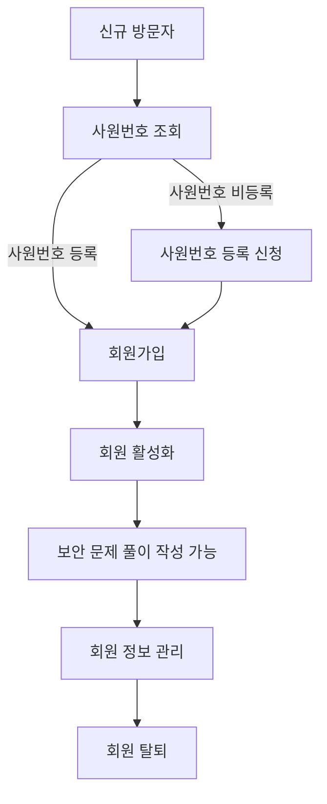
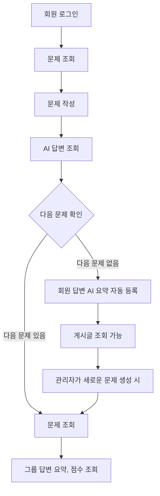
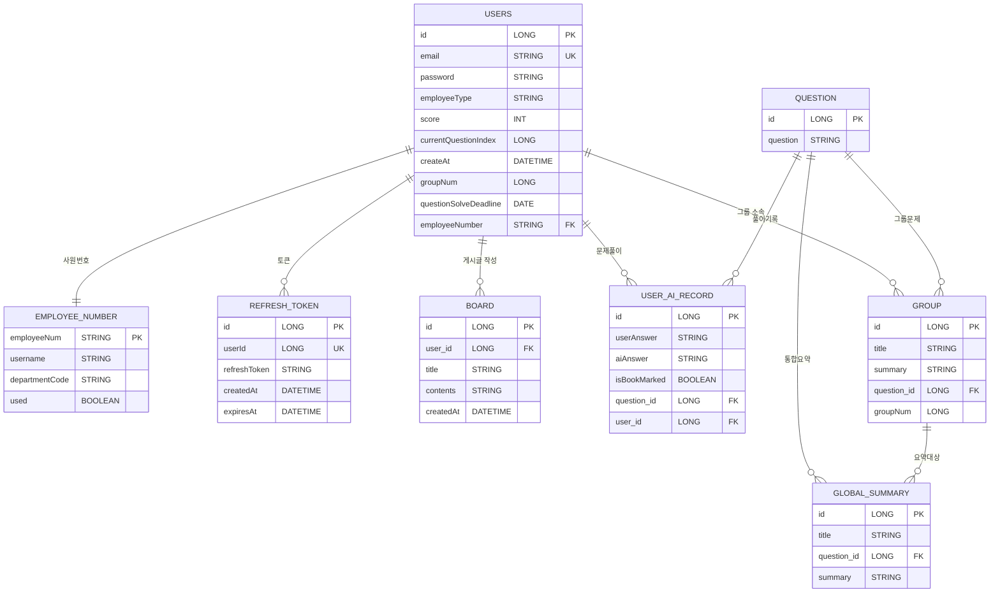
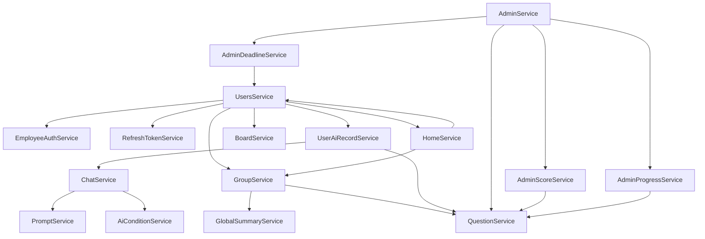

# 도메인 설계서

## 문서 정보
- **프로젝트명**: [제대로 보안니]
- **작성자**: [육하원칙/박효영]
- **작성일**: [2025-06-08]
- **버전**: [v2.0]
---

## 1. 프로젝트 개요

### 1.1 프로젝트 목적
> 실제 업무에서 발생할 수 있는 다양한 보안 공격 상황에 대한 문제 학습 플랫폼을 제공하여
> 조직 내 임직원과 Rookies 수강생을 대상으로 보안 사고에 대한 경각심을 발생시키고, 
> 보안 대응 역량을 향상시키는 것을 목표로 한다.

### 1.2 프로젝트 범위
**포함 범위:**
- [x] 회원 관리 (사원번호 조회, 가입, 정보 수정, 로그아웃)
- [x] 보안 문제 관리 (등록, 조회)
- [x] 문제 풀이 및 채점 (사용자 풀이 등록, AI 자동 채점, 모범답안 제공)
- [x] 문제와 이용자 답변 (조회, 북마크 조회, 개인 점수 조회)
- [x] 그룹 게시글 (그룹 별 문제 요약 조회, 전체 문제 요약 조회, 그룹별 점수 조회)
- [x] 커뮤니티 게시판 (생성, 수정, 조회, 삭제)
- [x] 관리자 페이지 (회원 정보 수정, 조회, 회원 탈퇴, 권한 변경, 문제 생성)

**제외 범위:**
- [x] 외부 회사와의 연동
- [x] 모바일 앱 (웹 기반만)

### 1.3 주요 이해관계자 (Stakeholders)
| 구분                         | 역할 | 주요 관심사                 |
|----------------------------|------|------------------------|
| **임직원** **Rookies수강생** | 시스템 사용자 | 보안 문제 학습, 직관적인 인터페이스 |
| **관리자**                    | 시스템 운영자 | 시스템 사용자 그룹 관리, 학습률 정보  |
| **보안 운영 담당자**              | 의사결정자 | 보안 문제 제공, 운영 효율성 향상  |
| **IT 관리자**                 | 시스템 관리자 | 시스템 안정성, 보안, 유지보수성     |

---

## 2. 비즈니스 도메인 분석

### 2.1 핵심 비즈니스 프로세스

#### 2.1.1 회원 관리 프로세스

**상세 플로우:**
1. **회원가입 단계**
    - 사원번호, 이름 조회
    - 사원번호, 이름 인증
    - 개인정보 입력 (이메일, 비밀번호)
    - 이메일 중복 확인
    - 비밀번호 확인
    - 회원가입 완료

2. **회원 활동 단계**
    - 보안 문제 작성
    - 작성한 보안 문제 조회
    - 북마크한 문제 조회
    - 그룹 및 전체 답변 요약, 점수 조회 
    - 게시글 작성 및 조회

#### 2.1.2 보안 문제 프로세스

**비즈니스 규칙:**
- 문제 답변 등록 마감 기한 설정 : 마감 기한 확인 가능, 
    기한 초과 시 문제 답변 등록 제한
- 게시판 접근 : 모든 사용자는 등록된 모든 문제 응답 완료 후 게시판 조회, 생성 가능

### 2.2 비즈니스 이벤트
| 이벤트                 | 트리거            | 결과                          |
|---------------------|----------------|-----------------------------|
| **문제 답변 제출**      | 회원 풀이 등록       | AI 자동 채점 점수 및 모범답안 조회       |
| **모든 문제 응답**      | 그룹 답변 요약 등록    | 회원 및 그룹 응답을 분석한 AI 요약 결과 조회 |
| **모든 문제 응답**   | 전체 회원 답변 요약 등록 | 모든 회원 응답을 분석한 AI 요약 결과 조회   |
| **모든 문제 응답**   | 게시글 조회 가능      | 게시글 작성 및 조회                 |
| **문제 답변 등록 마감기한** | 게시글 조회 가능      | 문제 답변 등록 제한               |

---

## 3. 핵심 도메인 객체 (Domain Objects)

### 3.1 도메인 객체 식별 매트릭스
| 도메인 객체                    | 유형 | 중요도 | 복잡도 | 비고        |
|---------------------------|------|-----|-----|-----------|
| **EmployeeNumber (직원)**   | Entity | 높음  | 중간  | 조직 임직원과 수강생 |
| **Users (회원)**            | Entity | 높음  | 높음  | 사용자       |
| **Question (문제)**       | Entity | 높음  | 낮음  | 핵심 자원     |
| **Group (그룹요약)**          | Entity | 중간  | 중간  | 그룹 요약 관리  |
| **UserAiRecord (문제답변)** | Entity | 중간  | 높음  | 핵심 비즈니스   |
| **GlobalSummary (전체요약)**  | Entity | 중간  | 중간  | 전체 요약 관리  |
| **Board (게시판)**           | Entity | 낮음  | 낮음  | 관리자 및 사용자 게시판 |
| **RefreshToken (토큰)**     | Entity | 높음  | 높음  | 회원 토큰     |
| **EmployeeType (회원유형)**   | Value Object | 낮음  | 낮음  | 확장 가능성    |

### 3.2 상세 도메인 객체 정의

#### 3.2.1 EmployeeNumber (직원)
**역할**: 관리자가 등록한 조직 내 임직원과 Rookies 수강생을 나타냄
- `employeeNum`: 고유 사원번호 (PK)
- `username`: 사원명
- `departmentCode`: 부서 코드
- `used`: 회원가입 여부

**주요 행동 (메서드):**
- `markAsUsed()`: 해당 사원번호를 사용 처리
- `verifyEmployeeAuth(request)`: 사원번호와 이름이 일치하는지 확인
- `getEmployeeType(employeeNum)`: 사원번호로 사원 레코드를 조회

**비즈니스 규칙:**
- 사원번호(employeeNum)는 유일해야 함
- 이미 회원가입 된 사원번호는 재회원가입 불가능
- 사원명이 일치하지 않으면 인증 실패

#### 3.2.2 Users (회원)
**역할**: '제대로 보안니' 학습 플랫폼을 이용하는 회원을 나타냄

**주요 속성:**
- `id`: 고유 식별자 (PK)
- `email`: 이메일 (로그인 ID, 유일)
- `password`: 비밀번호 (암호화 저장)
- `employeeType`: 사원 유형 (TRAINEE, EMPLOYEE, ADMIN)
- `score`: 점수 (기본값 0)
- `currentQuestionIndex`: 현재 문제 인덱스 (기본값 1)
- `createAt`: 가입 일시
- `groupNum`: 그룹 번호
- `questionSolveDeadline`: 문제 풀이 마감일
- `employeeNumber`: 사원번호 (FK)

**주요 행동 (메서드):**
- 
**비즈니스 규칙:**
- 이메일은 유일해야 하며, 로그인 ID로 사용함
- 회원 가입 시 가입일과 문제 풀이 마감일은 자동으로 설정
- 그룹 번호는 그룹 기반 서비스와 연동
- 점수와 문제 인덱스는 기본값으로 초기화

#### 3.2.3 Question (문제)
**역할**: '제대로 보안니' 학습 플랫폼에서 관리하는 정보 보안 문제

**주요 속성:**
- `id`: 고유 식별자 (PK)
- `question`: 문제 내용

**주요 행동 (메서드):**
- `getAllQuestions(Pageable pageable)`: 모든 문제를 페이지네이션하여 조회
- `getQuestionByIndex(Long userId)`: 해당 사용자의 현재 문제 인덱스에 해당하는 문제를 조회
- `createQuestion(QuestionDto.Request request)`: 새로운 문제 생성
- `searchQuestions(String keyword, Pageable pageable)`: 문제 내용에 키워드가 포함된 문제를 검색, 페이지네이션 결과 반환

**비즈니스 규칙:**
- 문제 내용은 비어 있을 수 없음
- 문제 조회 시 사용자의 문제 풀이 마감일이 지나면 예외 발생
- 문제 생성 시 입력값 검증 필수

#### 3.2.4 Group (그룹요약)
**역할**: 회원과 그룹 간의 관계 및 답변 요약 내용을 나타냄

**주요 속성:**
- `id`: 고유 식별자 (PK)
- `title`: 그룹명
- `summary`: 그룹 요약 설명
- `question`: 연결된 문제 (FK)
- `groupNum`: 그룹 번호 

**주요 행동 (메서드):**
- `getGroupList()`: 전체 그룹 목록을 조회하여 반환
- `getGroupInfoByGroupNum(Long groupNum)`: 특정 그룹 번호로 그룹 상세 정보 조회
- `getAverageScoreByGroupNum()`: 모든 그룹별 평균 점수를 계산하여 반환
- `getGroupAverageScore(Long groupNum)`: 특정 그룹 번호의 평균 점수를 계산하여 반환

**비즈니스 규칙:**
- 그룹 번호는 중복 없이 관리되어야 함
- 평균 점수 산출 시 전체 문제 수 × 100을 만점으로 계산

#### 3.2.5 UserAiRecord (문제답변)
**역할**: 회원과 문제 관련 정보의 관계를 나타냄

**주요 속성:**
- `id`: 고유 식별자 (PK)
- `userAnswer`: 사용자의 답변
- `aiAnswer`: AI가 생성한 답변
- `isBookMarked`: 북마크 여부 (기본값 false)
- `question`: 연결된 문제 (FK)
- `users`: 답변한 사용자 (FK)

**주요 행동 (메서드):**
- `saveUserAnswer(UserAiRecordDto.Request request)`: 사용자의 문제 답변을 저장
- `getUserAnswer()`: 모든 사용자 답변 기록을 조회
- `saveBookedmarked(UserAiRecordDto.BookmarkedRequest request)`: 특정 문제에 대한 북마크 상태를 토글(설정/해제)
- `getSolvedRecord(Long userId)`: 사용자가 푼 모든 문제 기록을 조회
- `getBookMarkedRecord(Long userId)`: 사용자가 북마크한 문제 기록만 조회

**비즈니스 규칙:**
- 사용자 답변은 반드시 존재해야 함
- 문제와 사용자는 모두 존재해야 함
- 사용자의 현재 문제 인덱스는 답변 저장 시 증가
- 북마크는 토글 방식으로 변경 가능

#### 3.2.6 GlobalSummary (전체요약)
**역할**: '제대로 보안니' 학습 플랫폼의 모든 회원 응답 요약

**주요 속성:**
- `id`: 고유 식별자 (PK)
- `title`: 요약 제목
- `question`: 연결된 문제 (PK)
- `summary`: 통합 요약 내용

**주요 행동 (메서드):**
- `updateContent(String onlyTitle, String onlySummary)`: 요약 제목과 내용을 수정
- `processGroqAllAnswer()`: 모든 회원 응답을 AI 서비스로 통합 요약 및 제목 생성 후 저장

**비즈니스 규칙:**
- 그룹 요약이 비어 있으면 AI 통합 요약을 생성하지 않음
- 기존 요약이 등록되어있지 않으면 새로 생성, 있으면 갱신

#### 3.2.7 Board (게시판)
**역할**: '제대로 보안니' 학습 플랫폼의 모든 문제를 푼 회원이 이용할 수 있는 게시판

**주요 속성:**
- `id`: 고유 식별자 (PK)
- `users`: 게시글 작성자 (FK)
- `title`: 게시글 제목 (최대 100자)
- `contents`: 게시글 내용 (최대 500자)
- `createdAt`: 게시글 작성 일시

**주요 행동 (메서드):**
- `getBoards(int page, int size)`: 전체 게시글을 페이지네이션하여 조회
- `getSingleBoard(Long id, Long userId)`: 특정 게시글을 상세 조회
- `writeBoard(WriteBoardRequestDTO request, Long userId)`: 게시글 작성
- `updateBoard(Long id, WriteBoardRequestDTO request, Long userId)`: 게시글 수정
- `deleteBoard(Long id, Long userId)`: 게시글 삭제
- `getTotalPages(int size)`: 전체 게시글 수 기준으로 총 페이지 수 계산

**비즈니스 규칙:**
- 게시글 작성자는 반드시 존재해야 함
- 게시글 제목과 내용은 각각 100자, 500자 이내로 작성
- 게시글 작성, 수정, 삭제는 작성자 본인만 가능

#### 3.2.8 RefreshToken (토큰)
**역할**: 회원 API 요청 시 이용하는 토큰을 나타냄

**주요 속성:**
- `id`: 고유 식별자 (PK)
- `userId`: 사용자 식별자 (Long)
- `refreshToken`: 리프레시 토큰 문자열
- `createdAt`: 토큰 생성 시각
- `expiresAt`: 토큰 만료 시각

**주요 행동 (메서드):**
- `saveOrUpdate(Long userId, String refreshToken, long expiresInDays)`: 회원 ID의 리프레시 토큰 갱신 또는 저장
- `validateRefreshToken(Long userId, String requestToken)`: DB에 저장된 토큰과 요청 토큰이 일치하는지 검증
- `updateRefreshToken(Long userId, String newRefreshToken, long expiresInDays)`: 기존 토큰을 새로운 값과 만료일로 갱신
- `deleteRefreshToken(Long userId)`: 로그아웃 시 해당 회원 리프레시 토큰을 삭제

**비즈니스 규칙:**
- 한 사용자 당 하나의 리프레시 토큰만 관리
- 토큰 저장 시 생성일과 만료일을 반드시 설정
- 토큰 검증 시 값이 일치하지 않으면 인증 실패
- 로그아웃 시 토큰을 즉시 삭제

---

## 4. 도메인 관계도

### 4.1 개념적 관계도

### 4.2 관계 상세 설명
| 관계                           | 카디널리티 | 설명                                 | 제약조건             |
|------------------------------|-------|------------------------------------|------------------|
| **Users ↔ Board**            | 1:N   | 한 사용자는 여러 게시글을 작성할 수 있음            | 본인만 작성/수정/삭제 가능  |
| **Users ↔ UserAiRecord**     | 1:N   | 한 사용자는 여러 문제 풀이 기록을 남길 수 있음        | 문제별 1개 기록        |
| **Users ↔ RefreshToken**     | 1:1   | 한 사용자는 하나의 리프레시 토큰만 가질 수 있음        | 중복 저장 불가         |
| **Users ↔ Group**            | N:1   | 여러 사용자가 하나의 그룹에 소속될 수 있음           | 그룹 소속 필수         |
| **Users ↔ EmployeeNumber**   | 1:1   | 한 사용자는 하나의 사원번호만 가질 수 있음           | 사원번호 중복 불가       |
| **Question ↔ Group**         | 1:N   | 한 문제는 여러 그룹에 연결될 수 있음              | 그룹 생성 시 문제 지정 필수 |
| **Question ↔ UserAiRecord**  | 1:N   | 한 문제는 여러 사용자의 풀이 기록을 가질 수 있음       | 사용자별 1개 기록       |
| **Question ↔ GlobalSummary** | 1:N   | 한 문제는 여러 통합 요약(GlobalSummary)와 연결됨 | 문제별 1개 요약 권장     |
| **Group ↔ GlobalSummary**    | 1:N   | 한 그룹은 여러 통합 요약의 대상이 될 수 있음         |                  |
| **EmployeeNumber ↔ Users**   | 1:1   | 한 사원번호는 하나의 사용자에만 연결됨              | 중복 불가            |

---

## 5. 비즈니스 규칙 (Business Rules)

### 5.1 사원번호 관련 규칙
| 규칙 ID       | 규칙 내용                           | 우선순위 | 검증 방법           |
|-------------|---------------------------------|------|-----------------|
| **BR-E001** | 사원번호는 유일해야 함                    | 높음   | 등록 시 중복 검사      |
| **BR-E002** | 사원번호는 한 번만 사용할 수 있음             | 높음   | 인증/가입 시 used 값  |
| **BR-E003** | 사원명이 일치해야 인증 가능                 | 높음   | 인증 시 이름 비교      |
| **BR-E004** | departmentCode가 없거나 공백이면 인증 불가  | 높음   | 인증 시 값 존재 여부 확인 |

### 5.2 회원 관련 규칙
| 규칙 ID       | 규칙 내용                   | 우선순위 | 검증 방법                |
|-------------|-------------------------|------|----------------------|
| **BR-U001** | 이메일은 회원별로 유일해야 함        | 중간   | 회원가입/수정 시 중복 검사      |
| **BR-U002** | 사원번호는 회원별로 유일해야 함       | 높음   | 회원가입/수정 시 중복 검사      |
| **BR-U003** | 회원가입 시 사원번호는 존재해야 함     | 높음   | 회원가입 시 사원번호 존재 여부 확인 |
| **BR-U004** | 회원의 그룹 번호는 필수임          | 높음   | 회원가입/수정 시 값 입력 여부 확인 |
| **BR-U005** | 회원의 가입일과 문제 마감일은 자동 생성  | 중간   | 회원 가입 시 자동 설정        |

### 5.3 문제 기록(UserAiRecord)  관련 규칙
| 규칙 ID       | 규칙 내용                         | 우선순위 | 검증 방법             |
|-------------|-------------------------------|------|-------------------|
| **BR-R001** | 한 문제에 대해 한 사용자는 한 번만 풀이 기록 가능 | 높음   | 저장 시 중복 기록 확인     |
| **BR-R002** | 북마크는 토글 방식으로만 변경 가능           | 중간   | 북마크 요청 시 현재 값 반전  |
| **BR-R003** | 사용자의 현재 문제 인덱스는 풀이 완료 시 증가    | 높음   | 답변 저장 시 자동 증가     |
| **BR-R004** | 문제 풀이 마감일 이후에는 풀이 불가          | 높음   | 문제 조회/풀이 시 날짜 비교  |

### 5.4 그룹 및 전체 요약(GlobalSummary) 관련 규칙
| 규칙 ID       | 규칙 내용                      | 우선순위 | 검증 방법                |
|-------------|----------------------------|------|----------------------|
| **BR-G001** | 그룹 생성 시 반드시 문제와 연결되어야 함    | 높음   | 저장 시 FK 존재 여부 확인     |
| **BR-G002** | 그룹별 평균 점수는 전체 문제 수 기준으로 산정 | 높음   | 점수 계산 시 전체 문제 개수 반영  |
| **BR-G003** | 전체요약은 문제별로 1개만 생성하는 것이 원칙  | 중간   | 저장 전 기존 요약 존재 여부 확인  |

### 5.5 게시글 관련 규칙
| 규칙 ID       | 규칙 내용                             | 우선순위 | 검증 방법            |
|-------------|-----------------------------------|------|------------------|
| **BR-B001** | 게시글 제목은 100자 이내, 내용은 500자 이내여야 함  | 높음   | 	저장/수정 시 길이 검증   |
| **BR-B002** | 게시글 작성, 수정, 삭제는 작성자 본인만 가능        | 높음   | 사용자 ID 일치 여부 확인  |
| **BR-B003** | 게시글 작성 시 작성 일시는 자동 생성             | 중간   | 저장 시 자동 설정       |

### 5.6 토큰 관련 규칙
| 규칙 ID       | 규칙 내용                     | 우선순위 | 검증 방법               |
|-------------|---------------------------|------|---------------------|
| **BR-T001** | 한 사용자당 하나의 리프레시 토큰만 저장 가능 | 높음   | 저장/갱신 시 기존 토큰 여부 확인 |
| **BR-T002** | 리프레시 토큰 값과 요청 값이 일치해야만 인증 | 높음   | 검증 시 값 비교           |
| **BR-T003** | 토큰 만료일은 반드시 설정되어야 함       | 높음   | 저장/갱신 시 값 설정        |

---

## 6. 도메인 서비스 (Domain Services)

### 6.1 식별된 도메인 서비스
| 서비스명                         | 책임                                   | 사용 시나리오                                         |
|------------------------------|--------------------------------------|-------------------------------------------------|
| **EmployeeAuthService**      | 사원 인증, 사원번호 검증                       | 사원번호 인증, 유형 판별, 중복/사용 여부 확인                     |
| **UsersService**             | 회원 계정 관리, 인증, 가입, 로그인                | 회원가입, 로그인, 이메일 중복, 정보 수정                        |
| **RefreshTokenService**      | 인증 토큰 관리, 세션 유지                      | 토큰 저장/갱신/검증/삭제                                  |
| **CustomUserDetailsService** | 사용자 인증을 위한 사용자 정보 로드                 | Spring Security 인증 연동                           |
| **QuestionService**          | 문제(퀴즈) 관리                            | 문제 생성, 조회, 검색, 마감일 관리                           |
| **UserAiRecordService**      | 문제 풀이 기록, AI 답변, 북마크 관리              | 회원 풀이 저장, 북마크, 풀이 이력/북마크 조회                     |
| **ChatService**              | AI 모범답안 및 점수 요청, AI 요약 요청 및 저장       | 회원에 맞는 응답, 그룹 정보 수집, AI 응답 요청 및 저장              |
| **AiConditionService**       | AI 프롬프트 및 답변 요청, AI 답변 JSON형식으로 구성   | AI 프롬프트 요청 및 응답 실행, 응답 결과 반환                    |
| **PromptService**            | AI 프롬프트 작성, 응답                       | AI 프롬프트 작성 및 반환                                 |
| **GroupService**             | 그룹 정보 및 통계 관리                        | 그룹 목록/정보, 그룹별 평균 점수 계산                          |
| **BoardService**             | 게시판 관리                               | 게시글 CRUD, 권한 검증                                 |
| **HomeService**              | 홈 관리                                 | 홈 페이지에 필요한 값 일괄 요청, 조별 점수 계산                    |
| **AdminService**             | 관리자용 회원 관리, 권한 변경, 회원 삭제             | 회원 전체/조건별 조회, 회원 삭제, 관리자 승격, 회원 정보/진행률/점수 통합 조회 |
| **AdminScoreService**        | 관리자용 회원 점수 관리                        | 전체 회원 점수 조회, 점수 내림차순(Top 10) 조회                 |
| **AdminProgressService**     | 관리자용 회원 학습 진행률 관리                    | 전체 회원/특정 회원의 학습 진행률 조회                          |
| **AdminDeadlineService**     | 관리자용 회원 문제 풀이 마감일 관리                 | 전체 회원/특정 회원의 마감일 조회, 마감일 수정, 마감일 경과 회원 조회       |

### 6.2 서비스 상호작용

---

## 7. 용어 정의 (Glossary)

### 7.1 비즈니스 용어
| 용어         | 정의                        | 영문                | 비고                       |
|------------|---------------------------|-------------------|--------------------------|
| **사원번호**   | 조직 내 임직원, 수강생을 식별하는 고유 번호 | Employee Number   | 회원가입 시 인증에 사용            |
| **회원**     | 보안 교육 플랫폼을 이용하는 사용자       | User              | 플랫폼에 회원가입한 임직원·수강생 모두 포함 |
| **문제**     | 학습용 정보 보안 퀴즈·시나리오         | Question          | 회원 풀이, AI 답변, 점수 산정 대상   |
| **그룹**     | 회원 소속 단위(부서, 조 등)         | Group             | 점수 집계, 요약, 통계 단위         |
| **전체요약**   | 모든 그룹의 답변을 AI가 통합 요약한 내용  | Global Summary    | 문제별 1개 생성 권장             |
| **토큰**     | 인증 및 세션 유지를 위한 값          | Token             |                          |
| **문제 마감일** | 문제 풀이 제한 기한               | Question Deadline | 마감 후 풀이 불가               |
| **북마크**    | 회원이 중요하다고 표시한 문제 풀이 기록    | Bookmark          | 즐겨찾기 기능                  |

### 7.2 기술 용어
| 용어                    | 정의                             | 비고                           |
|-----------------------|--------------------------------|------------------------------|
| **PK(기본키)**           | 테이블의 각 행을 유일하게 식별하는 컬럼         | Primary Key, 대리키/자연키 모두 가능   |
| **FK(외래키)**           | 다른 테이블의 PK를 참조하는 컬럼            | 관계형 데이터 무결성 유지               |
| **엔티티(Entity)**       | 고유 식별자(PK)를 갖는 도메인 객체          | Users, Question 등            |
| **DTO**               | 데이터 전송 객체, 계층 간 데이터 전달용        | ResponseDTO, RequestDTO 등    |
| **서비스(Service)**      | 비즈니스 로직을 담당하는 계층               | UsersService, AdminService 등 |
| **리포지토리(Repository)** | 데이터베이스 접근/조회를 담당하는 계층          | UsersRepository 등            |
| **트랜잭션(Transaction)** | 데이터 일관성을 보장하는 작업 단위            | @Transactional               |
| **FK 제약조건**           | 외래키 무결성 보장, 참조 무결성 위반 시 오류 발생  | 삭제/수정 제한                     |

---

## 8. 가정사항 및 제약조건

### 8.1 가정사항 (Assumptions)
- [x] 모든 회원은 이메일 주소를 보유하고 있음
- [x] 사원번호는 관리자가 시스템에 미리 등록하며, 중복되지 않음
- [x] 회원들은 기본적인 정보 보안에 대한 지식이 있음
- [x] 문제는 사전에 등록되어 있음
- [x] AI 답변 생성 및 요약 기능은 외부 AI 서비스와 연동하여 제공됨
- [x] 시스템은 한국어로만 서비스 제공

### 8.2 제약조건 (Constraints)
- [x] **기술적 제약**: Java 17, Spring Boot 3.4, MariaDB 10.11 사용
- [x] **보안 제약**: 개인정보보호법 준수, HTTPS 필수, 비밀번호 암호화 저장
- [x] **예산 제약**: Chat GPT API 월 10달러 이내

### 8.3 위험요소 (Risks)
| 위험             | 영향도 | 발생확률 | 대응방안                 |
|----------------|-----|------|----------------------|
| **사원번호 중복 등록** | 높음  | 낮음   | 등록 시 중복 검사, 트랜잭션 처리  |
| **AI 요약 오류**   | 중간  | 중간   | AI 응답 검증, 수동 검수 절차   |
| **개인정보 유출**    | 높음  | 낮음   | 암호화, 접근제어, 정기 보안 점검  |

---

## 9. 향후 확장 계획

### 9.1 단기 확장 (3개월 내)
- [ ] 웹소켓을 통한 문제 마감일 회원 알림 요청 
- [ ] 마감일 내 문제 미해결 회원 기록 조회
- [ ] 문제 갱신 자동 알림 기능
- [ ] 통계 대시보드 구현

### 9.2 중기 확장 (6개월 내)
- [ ] 모바일 앱 개발
- [ ] 외부 회사에 API 제공(파트너사 연동)
- [ ] 다국어 지원 (영어, 일본어)
- [ ] 회원별 활동 로그 및 이력 조회 기능
- [ ] 회원 리워드 시스템

### 9.3 장기 확장 (1년 내)
- [ ] AI 기반 자동 문제 출제 및 난이도 조정 시스템
- [ ] 빅데이터 기반 보안 취약점 분석 및 리포트
- [ ] AI 챗봇을 통한 실시간 Q&A 및 교육 지원

---

## 10. 검토 및 승인

### 10.1 검토 이력
| 버전   | 검토자       | 검토일        | 주요 변경사항 |
|------|-----------|------------|---------|
| v0.1 | [백엔드 개발자] | 2025-06-07 | 초안 작성   |
| v0.2 | [백엔드 개발자] | 2025-06-08 | 2안 작성   |

---