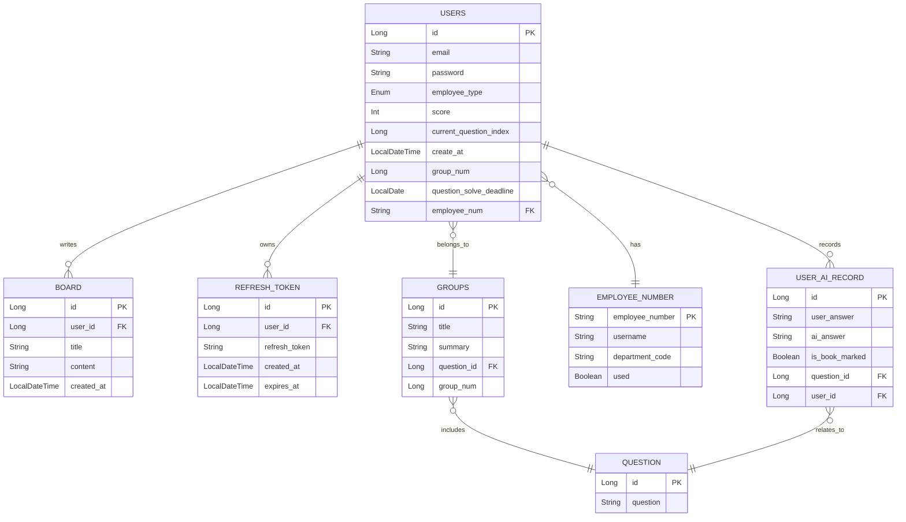

# Entity 설계서

## 문서 정보
- **프로젝트명**: [제대로 보안니]
- **작성자**: [팀명/최지은]
- **작성일**: [2025-06-07]
- **버전**: [v1.0]
- **검토자**: [박효영, 최지은]
- **승인자**: [이무현]

---
## 1. 공통 설계 규칙

### 1.1 네이밍 규칙
| 구분 | 규칙 | 예시                            | 비고          |
|------|------|-------------------------------|-------------|
| **Entity 클래스명** | PascalCase | `EmployeeNumber`, `Users`     | 단수형, 복수형 사용 |
| **테이블명** | snake_case | `employee_number`, `users`    | 단수형, 복수형 사용      |
| **컬럼명** | snake_case | `question_id`, `created_at`   | 언더스코어 구분    |
| **연관관계 필드** | camelCase | `findByIdWithUser`, `findByGroupNum` | 객체 참조명      |
| **boolean 필드** | is + 형용사 | `isBookMarked`   | 명확한 의미      |

### 1.2 공통 어노테이션 규칙
```java
// 기본 Entity 구조
@Entity
@Table(name = "테이블명")
@Getter
public class EntityName extends BaseEntity {
    // 필드 정의
}
```

### 1.3 ID 생성 전략
| Entity           | 전략 | 이유                        | 예시 |
|------------------|------|---------------------------|------|
| **Users**        | IDENTITY | MariaDB Auto Increment 활용 | 1, 2, 3, ... |
| **Question**     | IDENTITY | MariaDB Auto Increment 활용 | 1, 2, 3, ... |
| **Group**        | IDENTITY | 그룹별 답변 요약 순서 보장           | 1, 2, 3, ... |
| **UserAiRecord**        | IDENTITY | 회원별 답변 저장 순서 보장           | 1, 2, 3, ... |
| **GlobalSummary** | IDENTITY | MariaDB Auto Increment 활용 | 1, 2, 3, ... |
| **Board**        | IDENTITY | 작성일 기준 게시글 순서 보장          | 1, 2, 3, ... |
| **RefreshToken** | IDENTITY | MariaDB Auto Increment 활용 | 1, 2, 3, ... |
---

## 2. Entity 목록

### 2.1 Entity 분류 매트릭스
| Entity명           | 유형 | 비즈니스 중요도 | 기술적 복잡도 | 연관관계 수 | 우선순위 |
|-------------------|------|----------------|---------|--------|------|
| **EmployeeNumber** | 핵심 | 높음 | 중간      | 1개     | 1순위  |
| **Users**         | 핵심 | 높음 | 높음      | 3개     | 1순위  |
| **Question**      | 지원 | 높음 | 낮음      | 2개     | 1순위  |
| **Group**         | 지원 | 중간 | 중간      | 1개     | 2순위  |
| **UserAiRecord**  | 지원 | 중간 | 높음      | 2개     | 1순위  |
| **GlobalSummary**         | 지원 | 중간 | 중간      | 1개     | 2순위  |
| **Board**         | 지원 | 낮음 | 낮음      | 1개     | 3순위  |
| **RefreshToken**  | 지원 | 높음 | 높음      | 1개     | 2순위  |

### 2.2 Entity 목록
| Entity명           | 설명                              |
|-------------------|---------------------------------|
| **EmployeeNumber** | Rookies 수강생과 조직 내 임직원의 사원 번호 정보 |
| **Users**         | 회원가입을 한 사용자 정보                  |
| **Question**      | 질문 시나리오 정보                      |
| **Group**         | 그룹 정보 및 사용자 답변 요약 내용            |
| **UserAiRecord**  | 회원 및 AI의 답변 내용, 질문 북마크 여부 등의 정보 |
| **GlobalSummary**         | 그룹별 답변 요약 내용                    |
| **Board**         | 게시글 정보                          |
| **RefreshToken**  | 사용자의 refresh 토큰 정보              |

### 2.3 Entity 구조

---

## 3. Entity 속성

### 3.1.1 EmployeeNumber Entity

#### 3.1.2 구현 코드
```java
@Entity
@Getter
@Table(name = "employee_number")
public class EmployeeNumber {

    @Id
    @Column(length = 50, nullable = false)
    private String employeeNum;

    @Column(length = 100, nullable = false)
    private String username;

    @Column(length = 4, nullable = false)
    private String departmentCode;

    @Column(nullable = false)
    private boolean used;

    // 해당 사원번호의 회원가입 여부 판단
    public void markAsUsed() {
        this.used = true;
    }
}
```

#### 3.1.3 속성 상세 명세
| 필드명 | 데이터 타입         | 컬럼명               | 제약조건                     | 설명          | 비즈니스 규칙                                       |
|--------|----------------|-------------------|--------------------------|-------------|-----------------------------------------------|
| **employeeNum** | `String`       | `employee_num`    | PK, NOT NULL, LENGTH(50) | 회원 고유 사원번호  | SK + 8자리 숫자                                   |
| **username** | `String`       | `username`        | NOT NULL, LENGTH(100)    | 회원 성명       | 2-100자 한글/영문                                  |
| **departmentCode** | `String`       | `department_code` | NOT NULL, LENGTH(4)      | 회원 고유 그룹 번호 | 'T'/'E' + 3자리 숫자                              |
| **used** | `Boolean`      | `used`           | NOT NULL                 | 회원가입 여부     | 기본 값은 false이며, 회원가입을 진행한 사원번호는 used가 true로 갱신 |

### 3.2.1 Users Entity

#### 3.2.2 구현 코드
```java
@Entity
@Getter @Setter
@NoArgsConstructor(access = AccessLevel.PROTECTED)
@AllArgsConstructor(access = AccessLevel.PRIVATE)
@Builder
@Table(name = "users")
public class Users {

    @Id
    @GeneratedValue(strategy = GenerationType.IDENTITY)
    private Long id;

    @Column(nullable = false, unique = true)
    private String email;

    @Column(nullable = false)
    private String password;

    // EmployeeType Enum과 Enumerated
    @Enumerated(EnumType.STRING)
    @Column(nullable = false)
    private EmployeeType employeeType;

    // 점수는 0으로 시작
    @Column(nullable = false)
    @Builder.Default
    private int score = 0;

    // 문제 인덱스는 1로 시작
    @Column(nullable = false)
    @Builder.Default
    private Long currentQuestionIndex = 1L;

    @Column(nullable = false, updatable = false)
    private LocalDateTime createAt;

    @Column(nullable = false)
    private Long groupNum;

    @Column(nullable = false)
    private LocalDate questionSolveDeadline;

    // 1:1 - 사용자의 사원번호
    @OneToOne(fetch = FetchType.LAZY)
    @JoinColumn(name = "employeeNum", nullable = false)
    private EmployeeNumber employeeNumber;

    // 학습 마감일 처리 메서드(가입일 + 100일)
    @PrePersist
    public void prePersist() {
        this.createAt = LocalDateTime.now();
        this.questionSolveDeadline = LocalDate.now().plusDays(100);
    }
}
```
#### 3.2.3 속성 상세 명세
| 필드명 | 데이터 타입          | 컬럼명                       | 제약조건                         | 설명            | 비즈니스 규칙                        |
|--------|-----------------|---------------------------|------------------------------|---------------|--------------------------------|
| **id** | `Long`          | `id`                      | PK, NOT NULL, AUTO_INCREMENT | 회원 고유 식별자     | 시스템 자동 생성                      |
| **email** | `String`        | `email`                   | UNIQUE, NOT NULL             | 이메일           | 영문자, 숫자, 일부 특수문자를 포함           |
| **password** | `String`        | `password`                | NOT NULL                     | 비밀번호          | 영문자, 숫자, 일부 특수문자를 포함           |
| **employeeType** | `Enum(String)`  | `employee_type`           | NOT NULL                     | 회원 유형         | 수강생은 T, 임직원은 E로 시작             |
| **score** | `Int`           | `score`                   | NOT NULL, DEFAULT(0)         | 점수            | AI가 판단한 답변 점수                  |
| **currentQuestionIndex** | `Long`          | `current_question_index`  | NOT NULL, DEFAULT(1)         | 풀이할 문제 인덱스 번호 | 자동 갱신                          |
| **createAt** | `LocalDateTime` | `create_at`               | NOT NULL, UPDATABLE(false)   | 회원 가입일        | 가입한 일자 + 시간 자동 저장              |
| **groupNum** | `Long`       | `group_num`               | NOT NULL                     | 그룹 번호         | employeeNumber에서 영문과 0을 제외한 숫자 |
| **questionSolveDeadline** | `LocalDate`    | `question_solve_deadline` | NOT NULL                     | 학습 마감일         | 가입일 + 100일                     |
| **employeeNumber** | `String`        | `employee_number`         | NOT NULL, LENGTH(50)                        | 사원 번호         | EmployeeNumber에 저장되어 있는 사원 번호  |

### 3.3.1 Question Entity

#### 3.3.2 구현 코드
```java
@Entity
@Getter @Builder
@NoArgsConstructor(access = AccessLevel.PROTECTED)
@AllArgsConstructor(access = AccessLevel.PRIVATE)
@Table(name = "question")
public class Question {
    @Id
    @GeneratedValue(strategy = GenerationType.IDENTITY)
    private Long id;

    @Column(nullable = false)
    private String question;
}
```
#### 3.3.3 속성 상세 명세
| 필드명 | 데이터 타입 | 컬럼명 | 제약조건 | 설명         | 비즈니스 규칙       |
|--------|-------------|--------|----------|------------|---------------|
| **id** | `Long` | `id` | PK, NOT NULL, AUTO_INCREMENT | 질문 고유 식별자  | 시스템 자동 생성     |
| **question** | `String` | `question` | NOT NULL | 질문 시나리오 내용 | 관리자만 질문 생성 가능 |

### 3.4.1 Group Entity

#### 3.4.2 구현 코드
```java
@Entity
@NoArgsConstructor(access = AccessLevel.PROTECTED)
@AllArgsConstructor(access = AccessLevel.PRIVATE)
@Getter
@Builder
@Table(name = "groups")
public class Group {

    @Id
    @GeneratedValue(strategy = GenerationType.IDENTITY)
    private Long id;

    @Column
    private String title;

    @Column(columnDefinition = "TEXT")
    private String summary;

    // N:1 - 질문 id
    @ManyToOne(fetch = FetchType.LAZY)
    @JoinColumn(name = "question_id", nullable = false)
    private Question question;

    @Column(name = "group_num", nullable = false)
    private Long groupNum;

    public void updateContent(String title, String summary) {
        this.title = title;
        this.summary = summary;
    }
}
```

#### 3.4.3 속성 상세 명세
| 필드명 | 데이터 타입          | 컬럼명                       | 제약조건                             | 설명            | 비즈니스 규칙                        |
|--------|-----------------|---------------------------|----------------------------------|---------------|--------------------------------|
| **id** | `Long`          | `id`                      | PK, NOT NULL, AUTO_INCREMENT     | 그룹 고유 식별자     | 시스템 자동 생성                      |
| **title** | `String`        | `title`                   | NOT NULL                         | 그룹별 답변 요약 제목  | AI를 통해 요약한 제목                  |
| **summary** | `String`        | `summary`                 | NOT NULL, COLUMNDEFINITION(text) | 그룹별 답변 요약 내용  | AI를 통해 요약한 내용                  |
| **question** | `Long`  | `question_id`             | NOT NULL                         | 질문 id         | 해당 요약에 대한 대상 질문                |
| **groupNum** | `Long`           | `group_num`                   | NOT NULL             | 그룹 번호         | DepartmentCode에서 영문과 0을 제외한 숫자 |

### 3.5.1 UserAiRecord Entity

#### 3.5.2 구현 코드
```java
@Entity
@Getter @Builder
@NoArgsConstructor(access = AccessLevel.PROTECTED)
@AllArgsConstructor(access = AccessLevel.PRIVATE)
@Table(name = "user_ai_record")
public class UserAiRecord {

    @Id
    @GeneratedValue(strategy = GenerationType.IDENTITY)
    private Long id;

    @Column(nullable = false, columnDefinition = "TEXT")
    private String userAnswer;

    @Setter
    @Column(columnDefinition = "TEXT")
    private String aiAnswer;

    @Builder.Default
    @Setter
    @Column(nullable = false)
    private boolean isBookMarked = false;

    // N:1 - 질문 id
    @ManyToOne(fetch = FetchType.LAZY, optional = false)
    @JoinColumn(name = "question_id")
    private Question question;

    // N:1 - 사용자 id
    @ManyToOne(fetch = FetchType.LAZY, optional = false)
    @JoinColumn(name = "user_id")
    private Users users;
}
```

#### 3.5.3 속성 상세 명세
| 필드명 | 데이터 타입    | 컬럼명              | 제약조건                             | 설명        | 비즈니스 규칙             |
|--------|-----------|------------------|----------------------------------|-----------|---------------------|
| **id** | `Long`    | `id`             | PK, NOT NULL, AUTO_INCREMENT     | 그룹 고유 식별자 | 시스템 자동 생성           |
| **userAnswer** | `String`  | `user_answer`    | NOT NULL, COLUMNDEFINITION(text) | 사용자 답변 내용 | 질문에 대한 사용자의 답변      |
| **aiAnswer** | `String`  | `ai_answer`      | NOT NULL, COLUMNDEFINITION(text) | AI 답변 내용  | 질문에 대한 AI의 답변 및 피드백 |
| **isBookMarked** | `Boolean` | `is_book_marked` | NOT NULL, DEFAULT(false)         | 질문 북마크 여부 | 질문에 대한 사용자의 북마크 여부  |
| **question** | `Long`    | `question_id`    | NOT NULL                         | 질문 id     | 사용자의 답변의 대상 질문 id   |
| **users** | `Long`    | `user_id`        | NOT NULL                         | 회원 id     | 해당 정보에 대한 회원 id     |

### 3.6.1 GlobalSummary Entity

#### 3.6.2 구현 코드
```java
@Entity
@Builder @Getter
@NoArgsConstructor(access = AccessLevel.PROTECTED)
@AllArgsConstructor(access = AccessLevel.PRIVATE)
@Table(name = "global_summary")
public class GlobalSummary {

    @Id
    @GeneratedValue(strategy = GenerationType.IDENTITY)
    private Long id;

    @Column
    private String title;

    // N:1 - 문제 id
    @ManyToOne(fetch = FetchType.LAZY)
    @JoinColumn(name = "question_id", nullable = false)
    private Question question;

    @Column(columnDefinition = "TEXT")
    private String summary;

    public void updateContent(String onlyTitle, String onlySummary) {
        this.title = onlyTitle;
        this.summary = onlySummary;
    }
}
```

#### 3.6.3 속성 상세 명세
| 필드명 | 데이터 타입          | 컬럼명           | 제약조건                             | 설명           | 비즈니스 규칙         |
|--------|-----------------|---------------|----------------------------------|--------------|-----------------|
| **id** | `Long`          | `id`          | PK, NOT NULL, AUTO_INCREMENT     | 요약 번호 고유 식별자 | 시스템 자동 생성       |
| **title** | `String`        | `title`       | NOT NULL                         | 그룹별 답변 요약 제목 | AI를 통해 요약한 제목   |
| **question** | `Long`        | `question_id` | NOT NULL | 질문 id        | 대상 질문 id        |
| **summary** | `String`  | `summary` | NOT NULL, COLUMNDEFINITION(text)                         | 그룹별 답변 요약 내용        | AI를 통해 요약한 내용 |

### 3.7.1 Board Entity

#### 3.7.2 구현 코드
```java
@Entity
@Table(name="board")
@Getter @Setter
@Builder
@NoArgsConstructor
@AllArgsConstructor
public class Board {
    @Id
    @GeneratedValue(strategy = GenerationType.IDENTITY)
    private Long id;

    // N:1 - 사용자 id
    @ManyToOne(fetch = FetchType.LAZY)
    @JoinColumn(name="user_id",nullable = false)
    private Users users;

    @Column(nullable = false,length = 100)
    private String title;

    @Column(nullable = false,length = 500)
    private String contents;

    @Column(nullable = false,updatable = false)
    private LocalDateTime createdAt;

    @PrePersist
    public void prePersist(){
        this.createdAt=LocalDateTime.now();
    }
}
```

#### 3.7.3 속성 상세 명세
| 필드명 | 데이터 타입          | 컬럼명          | 제약조건                         | 설명         | 비즈니스 규칙         |
|--------|-----------------|--------------|------------------------------|------------|-----------------|
| **id** | `Long`          | `id`         | PK, NOT NULL, AUTO_INCREMENT | 게시글 고유 식별자 | 시스템 자동 생성       |
| **users** | `Long`          | `user_id`    | NOT NULL                     | 사용자 id     | 게시글을 작성한 사용자 id |
| **title** | `String`        | `title`      | NOT NULL, LENGTH(100)        | 게시글 제목     | 작성한 게시글의 제목     |
| **contents** | `String`        | `contents`   | NOT NULL, LENGTH(500)        | 게시글 내용     | 작성한 게시글의 내용     |
| **createdAt** | `LocalDateTime` | `created_at` | NOT NULL                     | 게시글 작성일자   | 게시글이 작성된 일자     |

### 3.8.1 RefreshToken Entity

#### 3.8.2 구현 코드
```java
@Entity
@Setter
@Getter
public class RefreshToken {
    @Id
    @GeneratedValue(strategy = GenerationType.IDENTITY)
    private Long id;

    private Long userId;

    private String refreshToken;

    private LocalDateTime createdAt;

    private LocalDateTime expiresAt;
}
```

#### 3.8.3 속성 상세 명세
| 필드명 | 데이터 타입          | 컬럼명             | 제약조건                         | 설명          | 비즈니스 규칙                 |
|--------|-----------------|-----------------|------------------------------|-------------|-------------------------|
| **id** | `Long`          | `id`            | PK, NOT NULL, AUTO_INCREMENT | 토큰 고유 식별자   | 시스템 자동 생성               |
| **userId** | `Long`          | `user_id`       |                      | 사용자 id      | 토큰 대상 사용자 id            |
| **refreshToken** | `String`        | `refresh_token` |         | refresh 토큰값 | 생성된 토큰값에 대한 refresh 토큰값 |
| **createdAt** | `LocalDateTime`        | `created_at`    |         | 토큰 생성일자     | 토큰이 생성된 일자              |
| **expiresAt** | `LocalDateTime` | `expires_at`    |                      | 토큰 만료일자     | 토큰이 만료되는 일자             |

### 3.9 Enum

#### 3.9.1 EmployeeType Enum
```java
public enum EmployeeType {
    TRAINEE,   // 교육생
    EMPLOYEE,  // 사원
    ADMIN      // 관리자
}
```
---

## 4. 연관관계 매핑

### 4.1 연관관계 매핑 규칙
| 관계 유형 | 기본 전략 | 이유 | 예외 상황 |
|----------|-----------|------|-----------|
| **@ManyToOne** | LAZY | 성능 최적화 | 필수 조회 데이터는 EAGER |
| **@OneToMany** | LAZY | N+1 문제 방지 | 소량 데이터는 EAGER |
| **@OneToOne** | LAZY | 일관성 유지 | 항상 함께 조회하는 경우 EAGER |
| **@ManyToMany** | 사용 금지 | 복잡성 증가 | 중간 테이블로 대체 |

### 4.2 Entity 연관관계 매핑

#### 4.2.1 Users Entity 연관관계 매핑
```java
// EmployeeType Enum과 Enumerated
@Enumerated(EnumType.STRING)
@Column(nullable = false)
private EmployeeType employeeType;

// 1:1 - 사용자의 사원번호
@OneToOne(fetch = FetchType.LAZY)
@JoinColumn(name = "employeeNum", nullable = false)
private EmployeeNumber employeeNumber;
```

#### 4.2.2 Group Entity 연관관계 매핑
```java
// N:1 - 질문 id
@ManyToOne(fetch = FetchType.LAZY)
@JoinColumn(name = "question_id", nullable = false)
private Question question;
```

#### 4.2.3 UserAiRecord Entity 연관관계 매핑
```java
// N:1 - 질문 id
@ManyToOne(fetch = FetchType.LAZY, optional = false)
@JoinColumn(name = "question_id")
private Question question;

// N:1 - 사용자 id
@ManyToOne(fetch = FetchType.LAZY, optional = false)
@JoinColumn(name = "user_id")
private Users users;
```

#### 4.2.4 GlobalSummary Entity 연관관계 매핑
```java
// N:1 - 질문 id
@ManyToOne(fetch = FetchType.LAZY)
@JoinColumn(name = "question_id", nullable = false)
private Question question;
```

#### 4.2.5 Board Entity 연관관계 매핑
```java
// N:1 - 사용자 id
@ManyToOne(fetch = FetchType.LAZY)
@JoinColumn(name="user_id",nullable = false)
private Users users;
```
---

## 5. 성능 최적화 전략

### 5.1 N+1 문제 해결
```java
// 질문 ID 리스트로 GlobalSummary 목록 조회
// N+1 문제 방지를 위해 question을 fetch join 방식으로 즉시 로딩
public interface GlobalSummaryRepository extends JpaRepository<GlobalSummary, Long> {
    @EntityGraph(attributePaths = {"question"})
    @Query("SELECT gs FROM GlobalSummary gs WHERE gs.question.id IN :ids")
    List<GlobalSummary> findByQuestionIds(@Param("ids") List<Long> ids);
}
```

### 5.2 쿼리 최적화
```java
public interface AdminRepository extends JpaRepository<Users, Long> {
    // 전체 Users 조회 대신 특정 필드(currentQuestionIndex)만 조회하여 쿼리 비용 최소화
    @Query("SELECT u.currentQuestionIndex FROM Users u WHERE u.id = :id")
    Long findCurrentQuestionIndexById(@Param("id") Long id);

    // 모든 회원을 페이징 처리하여 일정 범위로 나눠 조회 (대량 데이터 최적화)
    Page<Users> findAll(Pageable pageable);

    // 점수 기준 내림차순 정렬로 조회
    List<Users> findAllByOrderByScoreDesc();
}
```

---

## 6. 테스트 전략

### 6.1 Service 단위 테스트
```java
class UserServiceTest {

    @Mock
    private UsersRepository usersRepository;

    @InjectMocks
    private UserService userService;

    @BeforeEach
    void setUp() {
        MockitoAnnotations.openMocks(this);
    }

    @Test
    void getUserWithGroupScores_success() {
        Long userId = 1L;
        Long groupNum = 4L;
        EmployeeNumber employeeNumber = EmployeeNumber.builder()
                .employeeNum("SK12345678")
                .departmentCode("T001")
                .username("김관리")
                .used(true)
                .build();

        Users user = Users.builder()
                .id(userId)
                .employeeNumber(employeeNumber)
                .groupNum(groupNum)
                .employeeType(EmployeeType.ADMIN)
                .score(90)
                .build();

        when(usersRepository.findById(userId)).thenReturn(Optional.of(user));

        List<Object[]> groupAverages = Arrays.asList(
                new Object[]{1L, 72.0},
                new Object[]{2L, 80.0},
                new Object[]{3L, 90.0}
        );
        when(usersRepository.findGroupAverages()).thenReturn(groupAverages);


        UsersDto.UserGroupScoresResponse response = userService.getUserWithGroupScores(userId);

        assertThat(response.getUser().getUserId()).isEqualTo(userId);
        assertThat(response.getUser().getName()).isEqualTo("김관리");
        assertThat(response.getUser().getGroupNum()).isEqualTo(groupNum);
        assertThat(response.getUser().getEmployeeType()).isEqualTo(EmployeeType.ADMIN);
        assertThat(response.getUser().getPersonalScore()).isEqualTo(90);

        assertThat(response.getGroupScores()).hasSize(3);
        assertThat(response.getGroupScores()).extracting("groupNum")
                .containsExactlyInAnyOrder(1L, 2L, 3L);
        assertThat(response.getGroupScores()).filteredOn(gs -> gs.getGroupNum() == 3L)
                .extracting("groupScore").containsExactly(90);
    }

    @Test
    void getUserWithGroupScores_notFound() {
        Long userId = 990L;
        when(usersRepository.findById(userId)).thenReturn(Optional.empty());

        assertThatThrownBy(() -> userService.getUserWithGroupScores(userId))
                .isInstanceOf(BusinessException.class)
                .hasMessageContaining("해당 사용자를 찾을 수 없습니다");
    }
}
```

---

## 7. 성능 모니터링

### 7.1 환경별 설정

**개발환경 (application.properties)**
```properties
spring.application.name=boanni

# 기본 true
spring.devtools.restart.enabled=true

# 애플리케이션 포트 설정, 기본은 8080
server.port=8080

# 모든 IP 주소에서 접근 허용
server.address=0.0.0.0

# 현재 활성화된 환경
spring.profiles.active=[필요한 환경에 따라 선택]

# log file
logging.file.path=logs

# jwt 설정
jwt.expiration-ms=3600000
jwt.secret=[jwt key]
```

**테스트환경 (application-test.properties)**
```properties
# log level
logging.level.com.basic.myspringboot=debug

# mariadb db 설정
spring.datasource.url=jdbc:mariadb://127.0.0.1:3307/boanni_db
spring.datasource.username=boot
spring.datasource.password=boot

spring.datasource.driverClassName=org.mariadb.jdbc.Driver

# 실행 시 테이블 생성하고 , 종료 시 테이블 자동 삭제함
spring.jpa.hibernate.ddl-auto=update
spring.jpa.show-sql=true
spring.jpa.database-platform=org.hibernate.dialect.MariaDBDialect

# ai api 설정
spring.ai.openai.api-key=${GPT_API_KEY}
spring.ai.groq.api-key=${GROQ_API_KEY}

# thymeleaf 설정
spring.thymeleaf.prefix=classpath:/templates/
spring.thymeleaf.suffix=.html
spring.thymeleaf.mode=HTML
spring.thymeleaf.encoding=UTF-8
spring.thymeleaf.cache=false
spring.thymeleaf.check-template-location=true

# html에서 patch 매핑 동작하기 위한 설정
spring.mvc.hiddenmethod.filter.enabled=true
```

**운영환경 (application-prod.properties)**
```properties
#log level
logging.level.com.basic.myspringboot=WARN

# mariadb db 설정
spring.datasource.url=jdbc:mariadb://[database ip]:3307/boanni_db
spring.datasource.username=boot
spring.datasource.password=boot
spring.datasource.driverClassName=org.mariadb.jdbc.Driver

spring.jpa.hibernate.ddl-auto=update
spring.jpa.show-sql=true
spring.jpa.database-platform=org.hibernate.dialect.MariaDBDialect
spring.sql.init.mode=always
spring.jpa.defer-datasource-initialization=true
logging.level.org.springframework.jdbc.datasource.init.ScriptUtils=DEBUG

# ai api 설정
spring.ai.openai.api-key=${GPT_API_KEY}
spring.ai.groq.api-key=${GROQ_API_KEY}

# thymeleaf 설정
spring.thymeleaf.prefix=classpath:/templates/
spring.thymeleaf.suffix=.html
spring.thymeleaf.mode=HTML
spring.thymeleaf.encoding=UTF-8
spring.thymeleaf.cache=false
spring.thymeleaf.check-template-location=true

# html에서 patch 매핑 동작하기 위한 설정
spring.mvc.hiddenmethod.filter.enabled=true
```

---

## 8. 샘플 데이터

### 8.1 데이터용 초기 데이터

### 8.1.1 테이블명: employee_number
| employee_num | username | department_code | used |
|--------------|----------|--------------|------|
| SK12345678            | 김교육      | T001 | false     |
| SK87654321            | 박사원      | E002 | false    |

### 8.1.2 테이블명: users
| id | email              | password | employee_type | score | current_question_index | create_at | group_num | question_solve_deadline           | employee_num |
|----|--------------------|--------------|---------------|-------|------------------------|----------------------|--------|-------------------------|--------------|
| 1  | test1@naver.com    | password1!   | TRAINEE       | 0     | 1                      | 2025-06-01T10:30:00  | 1      | 2025-09-09              | SK12345678            |
| 2  | employee@gmail.com | paSSword2*   | EMPLOYEE      | 80    | 2                      | 2025-06-02T11:00:00  | 2      | 2025-10-15              | SK87654321            |

### 8.1.3 테이블명: groups
| id | title       | summary       | question_id | group_num |
|----|-------------|---------------|-------------|-----------|
| 1  | 보안 강화 방안   | 직원들은 비밀번호를...   | 1           | 1         |
| 2  | DB 유출 위험 | 암호화되지 않은... | 2           | 2         |

### 8.1.4 테이블명: question
| id | question               |
|----|------------------------|
| 1  | 모 기업은 고객 정보를 DB에 저장... |
| 2  | 2단계 인증...        |

### 8.1.5 테이블명: groups
| id | user_answer     | ai_answer          | is_book_marked | question_id | user_id |
|----|-----------------|--------------------|----------------|-----------|---------|
| 1  | DB에 값을 저장할 때... | 아웃도어 공격이 발생하여...   | false          | 1         | 1       |
| 2  | 피싱 공격은...       | 해당 개념에 대해 다시 학습... | true           | 2         | 2       |

### 8.1.6 테이블명: global_summary
| id | title    | summary            | question_id |
|----|----------|--------------------|-------------|
| 1  | 암호화의 중요성 | DB에 비밀번호를 저장할 때... | 1           |
| 2  | 의심스러운 링크 | 악성코드가 설치되어...      | 2           |

### 8.1.7 테이블명: board
| id | user_id | title        | content          | created_at          |
|----|---------|--------------|------------------|---------------------|
| 1  | 1       | XXS가 왜 문제일까? | XXS는 SQL...      | 2025-06-25T09:30:10 |
| 2  | 2       | 최근 모 기업에서... | 다들 이 기사 보셨나요?... | 2025-06-07T12:35:12 |

### 8.1.8 테이블명: refresh_token
| id | user_id | refresh_token        | created_at       | expires_at          |
|----|---------|----------------------|------------------|---------------------|
| 1  | 1       | eyJhbGciOiJIUzI1N... | 2025-06-01T10:30:00      | 2025-06-02T10:30:00 |
| 2  | 2       | eyJhbGciOiJIUzI1N... | 2025-06-02T11:00:00 | 2025-06-03T11:00:00 |

---

## 9. 마무리

### 9.1 주요 포인트 요약
1. **도메인 중심 설계**: 비즈니스 로직을 Entity에 캡슐화
2. **성능 최적화**: 페치 전략, 쿼리 최적화, N+1 문제 방지
3. **일관된 규칙**: 명명 규칙, 어노테이션 사용법 통일
4. **검증 및 제약조건**: 데이터 무결성 보장
5. **테스트 가능성**: 단위 테스트와 통합 테스트 고려

---