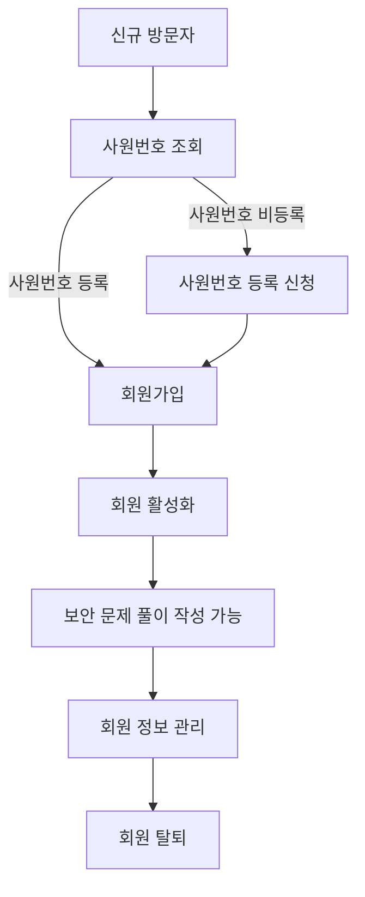
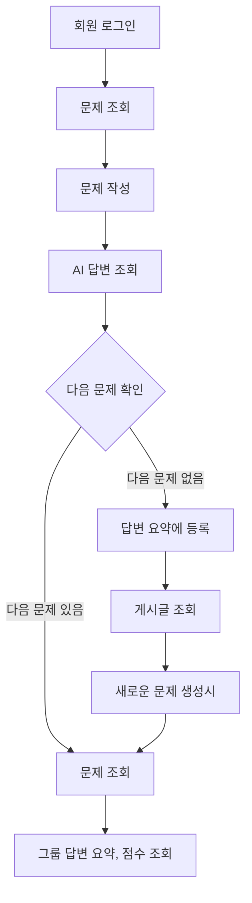

# 도메인 설계서

## 문서 정보
- **프로젝트명**: [보안 교육 웹 어플리케이션]
- **작성자**: [제대로 보안니/박효영]
- **작성일**: [2025-06-07]
- **버전**: [v1.0]
---

## 1. 프로젝트 개요

### 1.1 프로젝트 목적
> 실제 업무에서 발생할 수 있는 다양한 보안 공격 상황에 대한 문제 학습 플랫폼을 제공하여
> 조직 내 임직원과 Rookies 수강생을 대상으로 보안 사고에 대한 경각심을 발생시키고, 
> 보안 대응 역량을 향상시키는 것을 목표로 한다.

### 1.2 프로젝트 범위
**포함 범위:**
- [ ] 회원 관리 (사원번호 조회, 가입, 정보 수정, 로그아웃)
- [ ] 보안 문제 관리 (등록, 조회)
- [ ] 문제 풀이 및 채점 (사용자 풀이 등록, AI 자동 채점, 모범답안 제공)
- [ ] 문제와 이용자 답변 (조회, 북마크 조회, 개인 점수 조회)
- [ ] 그룹 게시글 (그룹 별 문제 요약 조회, 전체 문제 요약 조회, 그룹별 점수 조회)
- [ ] 커뮤니티 게시판 (생성, 수정, 조회, 삭제)

**제외 범위:**
- [ ] 외부 회사와의 연동
- [ ] 모바일 앱 (웹 기반만)

### 1.3 주요 이해관계자 (Stakeholders)
| 구분                         | 역할 | 주요 관심사                 |
|----------------------------|------|------------------------|
| **임직원** **Rookies수강생** | 시스템 사용자 | 보안 문제 학습, 직관적인 인터페이스 |
| **관리자**                    | 시스템 운영자 | 시스템 사용자 그룹 관리, 학습률 정보  |
| **보안 운영 담당자**              | 의사결정자 | 보안 문제 제공, 운영 효율성 향상  |
| **IT 관리자**                 | 시스템 관리자 | 시스템 안정성, 보안, 유지보수성     |

---

## 2. 비즈니스 도메인 분석

### 2.1 핵심 비즈니스 프로세스

#### 2.1.1 회원 관리 프로세스

**상세 플로우:**
1. **회원가입 단계**
    - 사원번호, 이름 조회
    - 사원번호, 이름 인증
    - 개인정보 입력 (이메일, 비밀번호)
    - 이메일 중복 확인
    - 비밀번호 확인
    - 회원가입 완료

2. **회원 활동 단계**
    - 보안 문제 작성
    - 작성한 보안 문제 조회
    - 북마크한 문제 조회
    - 그룹 및 전체 답변 요약, 점수 조회 
    - 게시글 작성 및 조회

#### 2.1.2 보안 문제 프로세스

**비즈니스 규칙:**
- 문제 답변 등록 마감 기한 설정 : 마감 기한 확인 가능, 
    기한 초과 시 문제 답변 등록 제한
- 
### 2.2 비즈니스 이벤트
| 이벤트                 | 트리거            | 결과                          |
|---------------------|----------------|-----------------------------|
| **문제 답변 제출**      | 회원 풀이 등록       | AI 자동 채점 점수 및 모범답안 조회       |
| **모든 문제 응답**      | 그룹 답변 요약 등록    | 회원 및 그룹 응답을 분석한 AI 요약 결과 조회 |
| **모든 문제 응답**   | 전체 회원 답변 요약 등록 | 모든 회원 응답을 분석한 AI 요약 결과 조회   |
| **모든 문제 응답**   | 게시글 조회 가능      | 게시글 작성 및 조회                 |
| **문제 답변 등록 마감기한** | 게시글 조회 가능      | 문제 답변 등록 제한               |

---

## 3. 핵심 도메인 객체 (Domain Objects)

### 3.1 도메인 객체 식별 매트릭스
| 도메인 객체                    | 유형 | 중요도 | 복잡도 | 비고        |
|---------------------------|------|-----|-----|-----------|
| **EmployeeNumber (직원)**   | Entity | 높음  | 중간  | 조직 임직원과 수강생 |
| **Users (회원)**            | Entity | 높음  | 높음  | 사용자       |
| **Question (문제)**       | Entity | 중간  | 낮음  | 핵심 자원     |
| **Group (그룹요약)**          | Entity | 중간  | 중간  | 그룹 요약 관리  |
| **UserAiRecord (문제답변)** | Entity | 높음  | 높음  | 핵심 비즈니스   |
| **GlobalSummary (전체요약)**  | Entity | 중간  | 높음  | 전체 요약 관리  |
| **Board (게시판)**           | Entity | 낮음  | 낮음  | 관리자 및 사용자 게시판 |
| **RefreshToken (토큰)**     | Entity | 높음  | 높음  | 회원 토큰     |
| **EmployeeType (회원유형)**   | Value Object | 낮음  | 낮음  | 확장 가능성    |

### 3.2 상세 도메인 객체 정의

#### 3.2.1 EmployeeNumber (직원)
**역할**: 관리자가 등록한 조직 내 임직원과 Rookies 수강생을 나타냄
- `employeeNum`: 고유 사원번호 (PK)
- `username`: 사원명
- `departmentCode`: 부서 코드
- `used`: 회원가입 여부

**주요 행동 (메서드):**
- `markAsUsed()`: 해당 사원번호를 사용 처리
- `verifyEmployeeAuth(request)`: 사원번호와 이름이 일치하는지 확인
- `getEmployeeType(employeeNum)`: 사원번호로 사원 레코드를 조회

**비즈니스 규칙:**
- 사원번호(employeeNum)는 유일해야 함
- 이미 회원가입 된 사원번호는 재회원가입 불가능
- 사원명이 일치하지 않으면 인증 실패

#### 3.2.2 Users (회원)
**역할**: '제대로 보안니' 학습 플랫폼을 이용하는 회원을 나타냄

**주요 속성:**
- `id`: 고유 식별자 (PK)
- `email`: 이메일 (로그인 ID, 유일)
- `password`: 비밀번호 (암호화 저장)
- `employeeType`: 사원 유형 (TRAINEE, EMPLOYEE, ADMIN)
- `score`: 점수 (기본값 0)
- `currentQuestionIndex`: 현재 문제 인덱스 (기본값 1)
- `createAt`: 가입 일시
- `groupNum`: 그룹 번호
- `questionSolveDeadline`: 문제 풀이 마감일
- `employeeNumber`: 사원번호 (FK)

**주요 행동 (메서드):**
- 
**비즈니스 규칙:**
- 이메일은 유일해야 하며, 로그인 ID로 사용함
- 회원 가입 시 가입일과 문제 풀이 마감일은 자동으로 설정
- 그룹 번호는 그룹 기반 서비스와 연동
- 점수와 문제 인덱스는 기본값으로 초기화

#### 3.2.3 Question (문제)
**역할**: '제대로 보안니' 학습 플랫폼에서 관리하는 정보 보안 문제

**주요 속성:**
- `id`: 고유 식별자 (PK)
- `question`: 문제 내용

**주요 행동 (메서드):**
- `getAllQuestions(Pageable pageable)`: 모든 문제를 페이지네이션하여 조회
- `getQuestionByIndex(Long userId)`: 해당 사용자의 현재 문제 인덱스에 해당하는 문제를 조회
- `createQuestion(QuestionDto.Request request)`: 새로운 문제 생성
- `searchQuestions(String keyword, Pageable pageable)`: 문제 내용에 키워드가 포함된 문제를 검색, 페이지네이션 결과 반환

**비즈니스 규칙:**
- 문제 내용은 비어 있을 수 없음
- 문제 조회 시 사용자의 문제 풀이 마감일이 지나면 예외 발생
- 문제 생성 시 입력값 검증 필수

#### 3.2.4 Group (그룹요약)
**역할**: 회원과 그룹 간의 관계 및 답변 요약 내용을 나타냄

**주요 속성:**
- `id`: 고유 식별자 (PK)
- `title`: 그룹명
- `summary`: 그룹 요약 설명
- `question`: 연결된 문제 (FK)
- `groupNum`: 그룹 번호 

**주요 행동 (메서드):**
- `getGroupList()`: 전체 그룹 목록을 조회하여 반환
- `getGroupInfoByGroupNum(Long groupNum)`: 특정 그룹 번호로 그룹 상세 정보 조회
- `getAverageScoreByGroupNum()`: 모든 그룹별 평균 점수를 계산하여 반환
- `getGroupAverageScore(Long groupNum)`: 특정 그룹 번호의 평균 점수를 계산하여 반환

**비즈니스 규칙:**
- 그룹 번호는 중복 없이 관리되어야 함
- 평균 점수 산출 시 전체 문제 수 × 100을 만점으로 계산

#### 3.2.5 UserAiRecord (문제답변)
**역할**: 회원과 문제 관련 정보의 관계를 나타냄

**주요 속성:**
- `id`: 고유 식별자 (PK)
- `userAnswer`: 사용자의 답변
- `aiAnswer`: AI가 생성한 답변
- `isBookMarked`: 북마크 여부 (기본값 false)
- `question`: 연결된 문제 (FK)
- `users`: 답변한 사용자 (FK)

**주요 행동 (메서드):**
- `saveUserAnswer(UserAiRecordDto.Request request)`: 사용자의 문제 답변을 저장
- `getUserAnswer()`: 모든 사용자 답변 기록을 조회
- `saveBookedmarked(UserAiRecordDto.BookmarkedRequest request)`: 특정 문제에 대한 북마크 상태를 토글(설정/해제)
- `getSolvedRecord(Long userId)`: 사용자가 푼 모든 문제 기록을 조회
- `getBookMarkedRecord(Long userId)`: 사용자가 북마크한 문제 기록만 조회

**비즈니스 규칙:**
- 사용자 답변은 반드시 존재해야 함
- 문제와 사용자는 모두 존재해야 함
- 사용자의 현재 문제 인덱스는 답변 저장 시 증가
- 북마크는 토글 방식으로 변경 가능

#### 3.2.6 GlobalSummary (전체요약)
**역할**: '제대로 보안니' 학습 플랫폼의 모든 회원 응답 요약

**주요 속성:**
- `id`: 고유 식별자 (PK)
- `title`: 요약 제목
- `question`: 연결된 문제 (PK)
- `summary`: 통합 요약 내용

**주요 행동 (메서드):**
- `updateContent(String onlyTitle, String onlySummary)`: 요약 제목과 내용을 수정
- `processGroqAllAnswer()`: 모든 회원 응답을 AI 서비스로 통합 요약 및 제목 생성 후 저장

**비즈니스 규칙:**
- 그룹 요약이 비어 있으면 AI 통합 요약을 생성하지 않음
- 기존 요약이 등록되어있지 않으면 새로 생성, 있으면 갱신

#### 3.2.7 Board (게시판)
**역할**: '제대로 보안니' 학습 플랫폼의 모든 문제를 푼 회원이 이용할 수 있는 게시판

**주요 속성:**
- `id`: 고유 식별자 (PK)
- `users`: 게시글 작성자 (FK)
- `title`: 게시글 제목 (최대 100자)
- `contents`: 게시글 내용 (최대 500자)
- `createdAt`: 게시글 작성 일시

**주요 행동 (메서드):**
- `getBoards(int page, int size)`: 전체 게시글을 페이지네이션하여 조회
- `getSingleBoard(Long id, Long userId)`: 특정 게시글을 상세 조회
- `writeBoard(WriteBoardRequestDTO request, Long userId)`: 게시글 작성
- `updateBoard(Long id, WriteBoardRequestDTO request, Long userId)`: 게시글 수정
- `deleteBoard(Long id, Long userId)`: 게시글 삭제
- `getTotalPages(int size)`: 전체 게시글 수 기준으로 총 페이지 수 계산

**비즈니스 규칙:**
- 게시글 작성자는 반드시 존재해야 함
- 게시글 제목과 내용은 각각 100자, 500자 이내로 작성
- 게시글 작성, 수정, 삭제는 작성자 본인만 가능

#### 3.2.8 RefreshToken (토큰)
**역할**: 회원 API 요청 시 이용하는 토큰을 나타냄

**주요 속성:**
- `id`: 고유 식별자 (PK)
- `userId`: 사용자 식별자 (Long)
- `refreshToken`: 리프레시 토큰 문자열
- `createdAt`: 토큰 생성 시각
- `expiresAt`: 토큰 만료 시각

**주요 행동 (메서드):**
- `saveOrUpdate(Long userId, String refreshToken, long expiresInDays)`: 회원 ID의 리프레시 토큰 갱신 또는 저장
- `validateRefreshToken(Long userId, String requestToken)`: DB에 저장된 토큰과 요청 토큰이 일치하는지 검증
- `updateRefreshToken(Long userId, String newRefreshToken, long expiresInDays)`: 기존 토큰을 새로운 값과 만료일로 갱신
- `deleteRefreshToken(Long userId)`: 로그아웃 시 해당 회원 리프레시 토큰을 삭제

**비즈니스 규칙:**
- 한 사용자 당 하나의 리프레시 토큰만 관리
- 토큰 저장 시 생성일과 만료일을 반드시 설정
- 토큰 검증 시 값이 일치하지 않으면 인증 실패
- 로그아웃 시 토큰을 즉시 삭제

---
